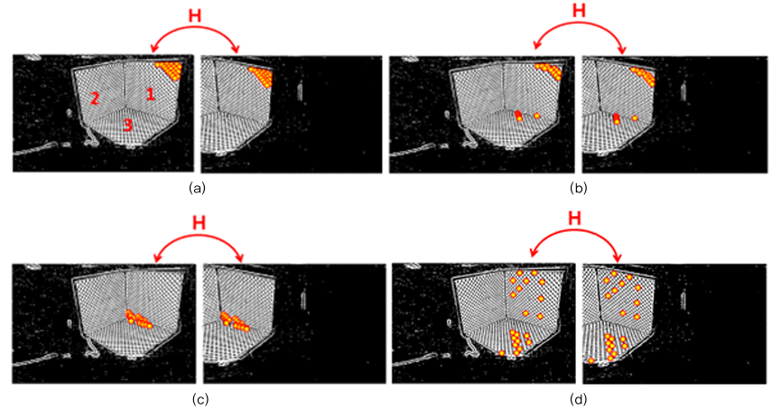
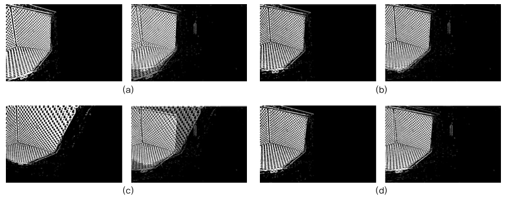

<h1 align="center">
  샘플링 영역의 변화에 따른 <br/>
희소 대응점을 가진 다시점 이미지 회전각 추정

<p align="center">
  <em>(Estimation of Rotation of Multiple-View Camera with Variation of Feature Sampling Region)</em>
</p>
</h1>

- 실제 열화상 카메라 영상에서 카메라 간 회전각을 추정하는 알고리즘을 구현<br/>
- 서로 다른 시점에서 거의 겹치지 않는 이미지의 대응점 문제를 해결하기 위해, 각 시점을 독립적으로 회전시켜 대응점을 확장하고, 다양한 샘플링 영역을 선택해 호모그래피 기반 회전 추정의 정확도를 분석 


## 주요 기능

* **영상 전처리**: DoG 필터를 이용해 열화상 영상의 경계 강조 및 노이즈 제거
* **샘플링 영역 선택**: 네 가지 방식(특정 사분면, 분산 영역 등)의 대응점 샘플링
* **호모그래피 추정**: RANSAC 기반 이상점 제거 후 호모그래피 계산
* **회전각 추출**: 추정된 호모그래피에서 회전 행렬을 분해하여 Z축 회전각 산출
* **결과 검증**: 이미지 블렌딩을 통해 정성적·정량적 성능 평가 


## 논문 정보

* **제목**: 샘플링 영역의 변화에 따른 희소 대응점을 가진 다시점 이미지 회전각 추정 
* **저자**: 한채림, 이덕우
* **학술지**: Journal of Korea Multimedia Society, Vol. 27, No. 12, pp. 1445–1452, 2024
* **DOI**: [10.9717/kmms.2024.27.12.1445](https://doi.org/10.9717/kmms.2024.27.12.1445)


## 폴더 구조

```plaintext
<repo-root>/
├── assets/
├── drawing/                          # 도형 그리기 및 패턴 분석
│   ├── 0828circledraw.ipynb          
│   └── Circlepattern.ipynb           
├── matching/                         # 특징점 매칭 
│   ├── 1029A_matching.ipynb          
│   ├── 1029B_matching.ipynb          
│   └── 1029C_matching.ipynb          
├── point_extraction/                 # 대응점 추출
│   ├── 1027a_point_extraction.ipynb  
│   ├── 1027b_point_extraction.ipynb  
│   └── 1027c_point_extraction.ipynb  
├── svd/                              # SVD 분해
│   └── 0828_SVDdecompose.ipynb       
├── README.md                         # 프로젝트 개요
└── requirements.txt                  # 의존성 목록
```

## 설치 및 실행

1. 의존성 설치

```bash
pip install -r requirements.txt
```

2. 데이터 준비

```bash
# data/raw 폴더에 열화상 이미지(.png 등)를 추가
```

3. 전처리 및 샘플링

```bash
python src/preprocessing.py --input data/raw --output data/processed
python src/sampling.py --input data/processed --method quadrant_a
```

4. 회전각 추정 및 결과 확인

```bash
python src/homography.py --input data/processed --config experiments/configs/quadrant_a.yaml
python src/rotation.py --input results/homography --output results/rotation
```

5. 블렌딩 이미지 생성

```bash
python src/blending.py --homography results/homography/H.npy --images data/raw --output results/blending
```


## 결과 및 평가
샘플링 영역을 기반으로 대응점에 대한 호모그래피 추정:
<p align="center">
  
</p>
호모그래피 행렬 추정 정확도 평가를 위해 선택된 샘플링 영역에 대한 이미지 블렌딩 결과:
<p align="center">
  
</p>

* 선택된 대응점이 특정 영역에 집중될 경우 왜곡 발생 (a, c)
* 넓게 분포된 대응점 선택의 경우 원본 이미지와 블렝딩 결과 유사하며, 호모그래피 변환의 정확성에 영향을 미침


